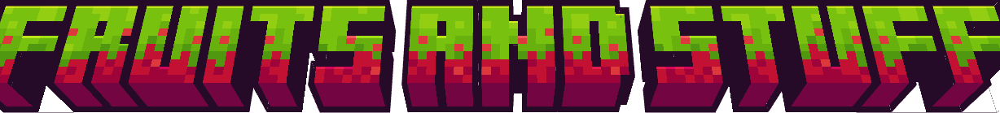

# Fruits and Stuff

Fruits and Stuff adds many fruits (so far.)

## Banana

A banana! A simple banana recipe looks like this:

A banana does 4 or 2.5 attack damage last time I remember, incase you are a major doofus and HATE your friend.

## Starch

Get Starch Seeds that do not spawn in

- Plains
- Forest / and other forest types

The main biome you need to mainly look in is Savannas.

## Candy Cane
A Candy Cane! A simple Candy Cane recipe looks like this:
  
 

Don't get too tipsy eating this!
  
